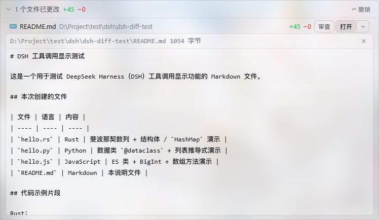

# DSH Diff Stat

[English](README.md) | [中文](README.zh.md)

[](https://github.com/deepseek-ai/deepseek-harness)
[](https://www.npmjs.com/package/dsh-diff-stat) [](https://www.npmjs.com/package/dsh-diff-stat)
[](https://github.com/deepseek-ai/deepseek-harness)

[](LICENSE)


[DeepSeek Harness](https://github.com/deepseek-ai/deepseek-harness) Web 插件：为 `edit`/`write` 工具行提供行内 **+N −M** 徽标，并在每轮结束时给出文件变更汇总卡。点击展开完整 unified diff；Code Dispatch（PTC）嵌套子调用照常工作（参数兜底推导，不依赖 wire diff 视图）。不依赖 git，不依赖任何第三方插件。

## 功能

- **行内 +N −M 徽标**：接管 stock 的 edit/write 工具行（keyed 低优先阴影，卸载自动还原 stock），收起态即见增删行数——运行中用参数推导预估，结算后以 resultView 精确值替换
- **展开完整 diff**：点击行展开 unified diff，渲染走 stock `DiffBlock` 原语（16 行限高折叠、复制、`└ +A -R` 页脚、主题令牌）
- **轮末汇总卡**：每轮消息流尾部折叠条「N 个文件已更改 +X −Y」；展开逐文件行（分类型文件图标 · 文件名 · 目录 · ±行数 · 审查 · 打开|▾），同文件多次编辑合并累计
- **PTC/Code Dispatch 兜底**：嵌套子调用在 wire 上没有任何 diff 视图，插件按工具自身 `presentCall` 语义从参数推导调用时 diff（edit 的 old→new、write 的整文件新增）；`rootCallId+subCallId` 去重防重放双计
- **撤销**：一键把本轮改动恢复到轮前状态——hunk 链倒序唯一性回剥、本轮新建文件删除、文件漂移拒绝写入、原子写
- **内嵌查看**：点「打开」直接在条目下方展开限高文件内容窗口（16 行折叠，与 stock DiffBlock 同款交互）；「▾」菜单保留全部打开方式
- **上下文折叠**：展开 diff 前 hunk 两侧做行级 LCS 对齐——共同行作变更块 ±3 行上下文，更远未变更区间折叠为 ⋯；徽标与页脚统计保持全量口径
- **毛玻璃（可选）**：安装 [deepseek-harness-background](https://github.com/HaoyueQin/deepseek-harness-background) 后，本插件全部表面并入其共享玻璃配方——diff 窗口、文件预览、行内 IN/OUT 卡用 token 模式，轮末汇总卡用 fill 模式；毛玻璃开启时 +/− diff 底色微调增强，保证红绿标注可读；未安装时全部保持现有不透明外观——优雅降级、零依赖
- **打开系**：系统打开（本体 `openFile`）+ 资源管理器定位 + VS Code 打开 + 复制绝对/相对路径
- **中英文**：跟随 Web 界面语言（locale 服务）

## 截图

| 毛玻璃下的展开 diff | 轮末卡 + 内联文件预览 |
| --- | --- |
|  |  |

## 机制

- **行内徽标**：注册进 `tool.call.toolview` keyed 槽的 `edit`/`write` 键，priority −1 阴影 shipped 行；diff 数据按「resultView → callView → 参数兜底」三级提取（顺序即合同：窗口截断丢 callView 时仍可从 resultView 渲染）
- **轮末汇总卡**：`ConversationNodeDefinition` 聚合器（`turn/start` / `tool/call` / `tool/result(append)` / `tool/code-dispatch`）发布 Turn 数据，`conversation.chat.turnTail` 链认领渲染；结构遵循官方 `ui-deliverables` 模式
- **host 半**（可选）：同源前缀路由提供围栏 API——realpath 包含性（解析前后双查）、符号链接拒绝、UTF-8 回环校验、512 KiB 读取截断、原子写；host 半缺席时相关按钮自动隐藏
- **毛玻璃桥（可选）**：零依赖消费 background 插件的 `window.__DSH_BACKGROUND_GLASS__` 注册表——`[data-diff-window]`、`[data-diff-stat-peek]`、`[data-diff-stat-io]` 用 token 模式，`[data-diff-stat-card]` 用 fill 模式；常驻订阅 `dsh-background-glass:ready`（覆盖两种到达顺序与热重载），桥不存在时普通界面原样保留

## 安装

```sh
# 从 npm 安装
dsh plugin --profile web add dsh-diff-stat

# 或从 GitHub 安装
dsh plugin --profile web add github:HaoyueQin/dsh-diff-stat

# 重启 dsh web 生效
dsh web
```

卸载：

```sh
dsh plugin --profile web remove dsh-diff-stat
```

## 开发

```sh
npm install --legacy-peer-deps          # devDependencies（peer 均为 dsh 内部包）
DSH_CHECKOUT=<dsh checkout> bash scripts/build.sh   # host 半 → lib/（junction 链接 + tsc）
npm run build:client                    # 浏览器半 → lib/client.js（tsdown）
npm run typecheck                       # 双端 tsc
```

## License

MIT